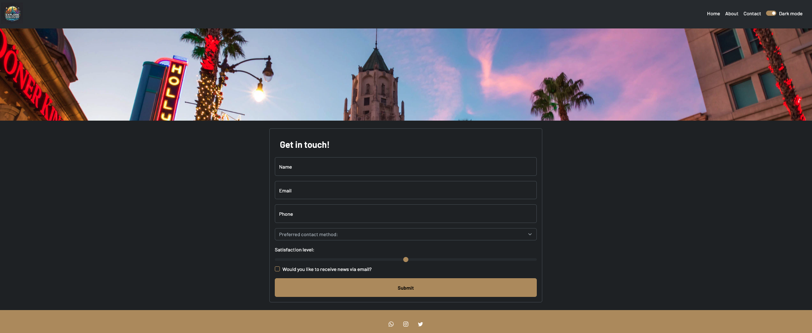

# 🌍 Explore & Discover

**Explore & Discover** is the ultimate platform for travelers who want to experience the best cities in the United States. Our personalized guides highlight top attractions, restaurants, and events, making it easier for you to plan and enjoy a unique trip tailored to your preferences. With interactive maps and custom itineraries, each journey becomes unforgettable.

---

## ✨ Key Features
- **Personalized Travel Guides**: Discover tailored guides to the top U.S. cities, showcasing landmarks, hidden gems, and local experiences.
- **Interactive Maps**: Easily navigate cities and find attractions, restaurants, and landmarks near you.
- **Custom Itineraries**: Plan your trip with personalized itineraries designed just for you.
- **Top Restaurant Recommendations**: Explore and book the best dining experiences each city has to offer.

---

## 🖼️ Website Preview




---

## 🚀 How to Get Started

1. **Clone the repository**:
    ```bash
    git clone https://github.com/cmontilha/explore-discover.git
    ```
2. **Install dependencies**:
    ```bash
    npm install
    ```
3. **Run the project**:
    ```bash
    npm start
    ```

---

## 🛠️ Technologies Used
- **HTML5 & CSS3**: For building responsive layouts.
- **JavaScript**: To handle dynamic interactions.
- **Bootstrap**: For modern, responsive design.

---

## Visit the Website

Check out the live version of the project here: [Explore-Discover Website](https://cmontilha.github.io/ExploreDiscover/)


2024 © Fictional project with no commercial purposes.
